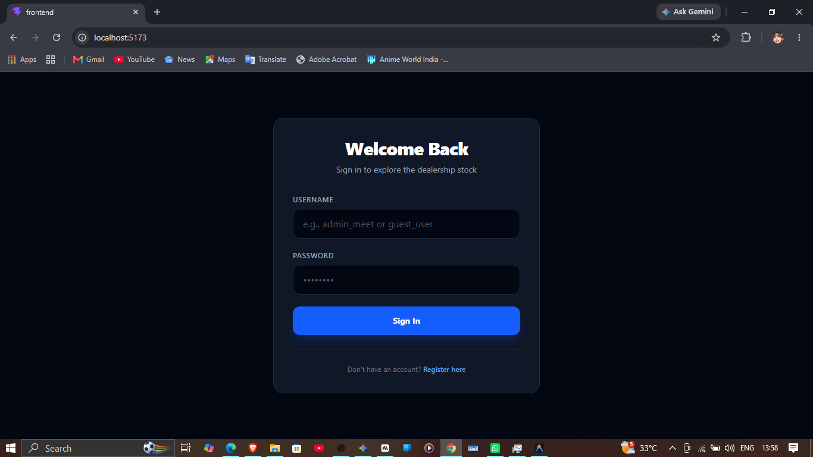
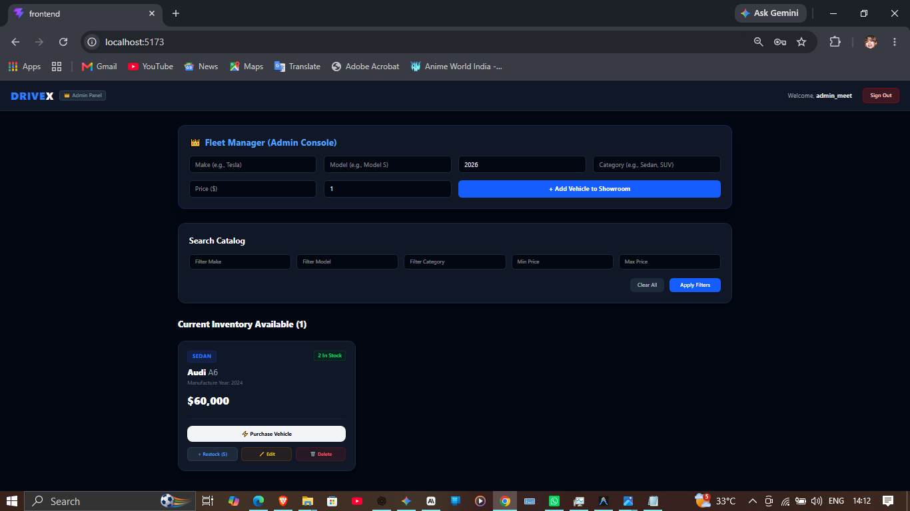
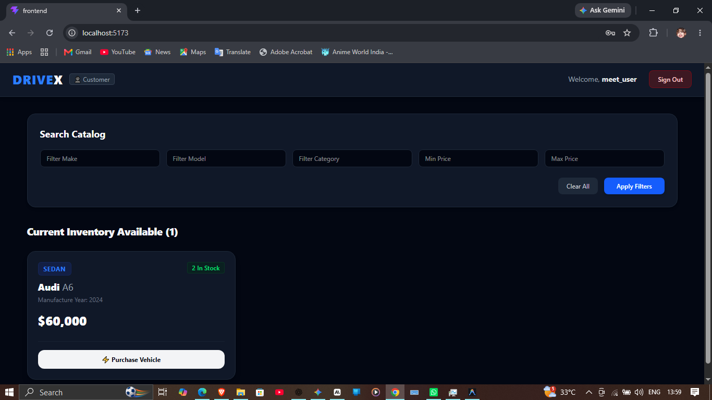

# Car Dealership Inventory System

A full-stack Car Dealership Inventory System built following Test-Driven
Development (TDD), with JWT-based authentication, role-based access control
(admin vs customer), and inventory management (purchase/restock).

Built as part of the Incubyte placement assessment.

## Tech Stack

**Backend:** Python 3.13, FastAPI, SQLAlchemy (SQLite database), PyJWT for
token auth, bcrypt for password hashing, pytest for testing.

**Frontend:** React (Vite), Tailwind CSS v4, axios.

## Features

- User registration and login with JWT authentication
- Role-based access: admin users can add/update/delete vehicles and restock
  inventory; regular users can browse, search, and purchase
- Vehicle CRUD with search/filter by make, model, category, and price range
- Purchase flow that decrements stock and marks a vehicle "out of stock" at
  zero quantity
- Admin-only restock endpoint

## Screenshots

| Login | Register |
|---|---|
|  |  |

| Admin View | Customer View |
|---|---|
|  |  |

## Setup & Run Locally

### Backend

```bash
cd backend
python -m venv Car_Dealership
# Windows:
.\Car_Dealership\Scripts\Activate.ps1
# macOS/Linux:
source Car_Dealership/bin/activate

pip install -r requirements.txt

# Create a .env file in the project root with:
# SECRET_KEY=<any long random string>

python -m uvicorn app.main:app --host 127.0.0.1 --port 8000
```
Backend runs at `http://127.0.0.1:8000`.

### Frontend

```bash
cd frontend
npm install
npm run dev
```
Frontend runs at `http://localhost:5173`.

### Running Tests

```bash
cd backend
pytest -v
```

## Test Report
======================= test session starts =======================
platform win32 -- Python 3.13.14, pytest-9.1.1
collected 14 items
backend\tests\test_auth.py ....                              [ 28%]
backend\tests\test_vehicles.py ..........                    [100%]
================= 14 passed, 1 warning in 23.53s ==================
## Known Limitations

- **Admin assignment**: for this kata, a user is marked as admin if their
  chosen username contains the substring "admin" (checked at registration
  time in `crud.py`). This is a simplification for testing purposes only —
  a production system would use a seed script or promotion by an existing
  admin instead of a self-declared username pattern.
- **CORS** is currently configured to allow only the local Vite dev server
  origins (`localhost:5173` / `127.0.0.1:5173`); this would need to be
  updated to the deployed frontend's origin for a production deployment.

## My AI Usage

**AI tools used:** Claude (Anthropic), used conversationally throughout
development for planning, code review, and debugging; and Antigravity
(Google's agentic IDE), used to execute file edits, terminal commands, and
git commits based on instructions worked out with Claude.

**How they were used:**

- Claude was used as a planning and review partner throughout the project —
  reviewing each piece of code before it was committed, catching issues like
  duplicate imports, a hardcoded JWT secret with no expiry, and PROMPTS.md
  content that didn't match the actual codebase.
- Claude helped design the TDD workflow (Red-Green-Refactor cycle) for each
  feature: auth, vehicle CRUD, search, and the purchase/restock flow.
- For the later stages (frontend wiring, environment cleanup, and bug
  fixes), instructions were handed to Antigravity as detailed, scoped
  prompts, which it executed directly in the project directory and reported
  results back in plain text for review.
- Three real bugs were found and fixed this way: (1) password hashing broke
  on Python 3.13 because `passlib` depends on the removed `crypt` module —
  fixed by switching to pure `bcrypt` and `PyJWT`; (2) the frontend couldn't
  reach the backend at all because of a missing CORS configuration; (3)
  Tailwind CSS v4's setup (a new Vite plugin, `@import` syntax) wasn't
  configured, so no styles were applied at all. All three were diagnosed
  with a root-cause explanation before being fixed.

**Reflection:** Using AI didn't replace understanding the code — every
generated piece was reviewed, tested, and in a few cases corrected before
being committed (for example, a suggestion to rewrite git history to hide
an early in-memory-storage implementation was rejected, since the project
brief explicitly asks for commit history that narrates the real development
journey). What it did change was the pace of iterating on the Red-Green-
Refactor cycle, and the ability to catch real bugs quickly with an
explanation of the root cause rather than a guess-and-check approach.

## Repository

https://github.com/jaisingmeet/car_dealership_inventory